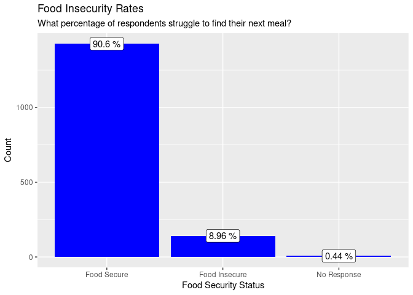
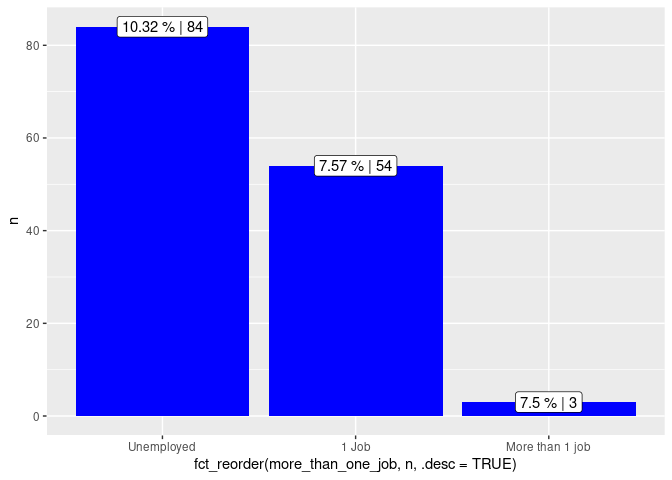
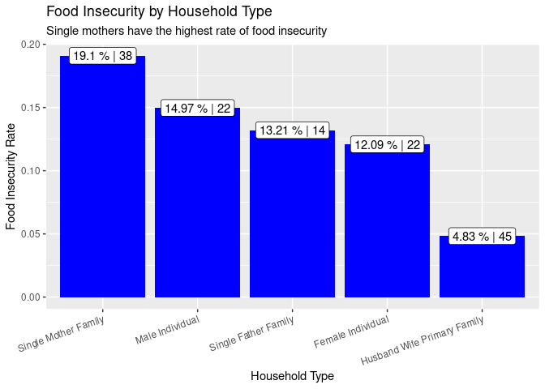

Food Insecurity in Oregon 2020
================
Westley Winks
11/21/2021

-   [Ask](#ask)
-   [Prepare](#prepare)
    -   [Factors to consider](#factors-to-consider)
-   [Process](#process)
-   [Analyze](#analyze)
    -   [What was the food insecurity rate in Oregon in
        2020?](#what-was-the-food-insecurity-rate-in-oregon-in-2020)
    -   [What types of people are most food
        insecure?](#what-types-of-people-are-most-food-insecure)
        -   [How much do food insecure people
            work?](#how-much-do-food-insecure-people-work)
        -   [Do different races experience more food
            insecurity?](#do-different-races-experience-more-food-insecurity)
        -   [More analysis](#more-analysis)
-   [Share](#share)
-   [Act](#act)
    -   [Further Exploration](#further-exploration)

Note: This project is serving two purposes. First, it is a personal
project that I have been interested in that will support my portfolio
for the work that I want to do. Second, this is my chosen capstone
project for a Google Data Analytics course I am taking.

# Ask

I work tangentially for a non-profit in my area that raises cattle,
butchers them, and gives the beef away to food banks in 3 different
states to alleviate some food insecurity in the world. I understand the
mission and the vision of the organization but I got to thinking: How
big of an issue is food insecurity? How much bigger does this
organization need to get to feed everyone so no one has to wonder where
their next meal is coming from?

Food insecurity has many definitions but I like Feeding America’s
definition: “food insecurity refers to a lack of available financial
resources for food at the household level.” This is the definition that
I have in mind throughout this analysis. Other definitions include:  
- USDA: “a lack of consistent access to enough food for an active,
healthy life”  
- healthypeople.gov: “the disruption of food intake or eating patterns
because of lack of money and other resources”

While there are major organizations that use food insecurity data to do
good (much better than I can), I hope my analysis does some good as
well. I want to help my local community and state where I have lived my
entire life. For these reasons, I am restricting my analysis to just
Oregon in 2020. As new data comes in, I will analyze and compare to keep
it relevant and (hopefully) useful for local non-profits and good
Samaritans.

As a basis for the project, I am attempting to answer the following:  
- What is the food insecurity rate in Oregon in 2020?  
- What types of households are most food insecure in Oregon?  
- Where are food insecure people in Oregon?  
- What is a general profile for a food insecure person in Oregon?

# Prepare

Data for this project is coming from the Current Population Survey
(CPS). The United States Census Bureau surveys 54,000 households each
month to get a clear picture of the labor force in the United States.
Every December, they also administer a supplemental food security
survey. This extends the picture to get an even better idea of the
health and wellness of the nation. The full technical appendix is in
this repository as “cps20pub.pdf”.

In the full data set for 2020, there are 132,036 observations across 507
variables. There are major entities (ERS, USDA, Feeding America) that
use all of this data to get important stats and summaries of the nation.
It also includes entries for households that were not interviewed or
otherwise unable to complete the survey. For simplicity, I want to only
look at certain factors that I think will be the most interesting.

## Factors to consider

-   HRINTSTA = Interview status of household
-   HRFS12M1 = Food insecurity status, last 12 months
-   HRFS30D1 = Food insecurity status, last 30 days
-   GESTFIPS = Geographic FIPS code (Oregon is 41)
-   HRPOOR = Above or below 185% poverty level, determined from family
    income
-   HRNUMHOU = Household size
-   HRHTYPE = Household type
-   GTMETSTA = Metro status
-   PEMARITL = Marital status
-   PESEX = Sex (non-binary not represented)
-   PEAFEVER = Did you serve active duty? (1 is yes, 2 is no)
-   PEEDUCA = Highest level of school completed
-   PTDTRACE = Race
-   PRCITSHP = Citizenship status
-   PEMJOT = Do you have more than one job?
-   PEHRUSLT = How many hours per week do you work each week?
-   HRSUPINT = Whether or not they were interviewed for food security
    supplement survey
-   PRTAGE = Age

# Process

I first downloaded the data directly from the Census Bureau
[here](https://www.census.gov/data/datasets/time-series/demo/cps/cps-supp_cps-repwgt/cps-food-security.html).
It is also compressed in this repository under “dec20pub.zip”. This
comes as a large 182 MB `.csv` file. Since I don’t particularly like
this file format or the space it takes up, I converted it to a
`.parquet` file which is smaller (same data at 21.6 MB) and reads faster
than `.csv`.

``` r
# library(arrow)
# write_parquet(read_csv("dec20pub.csv"), "dec20pub.parquet")
```

For simplicity, I only want to pull out specific ones that will help
answer the questions described above. The selected variables are listed
above. I am also choosing to just look at responses from Oregon. I also
want to put in more meaningful variable names and definitions.

``` r
library(tidyverse)
library(janitor)
library(arrow)
```

To clean the data, I first filtered the data. I `select`ed the variables
above. I also `filter`ed based on my critera of only looking at Oregon
and since I am interested in looking at food insecurity, I filtered out
people who didn’t complete the supplemental food security interview. I
also filtered out people who only partially completed the survey.

``` r
df <- read_parquet("dec20pub.parquet") %>%
  select(HRINTSTA, HRFS12M1, HRFS30D1, GESTFIPS, HRPOOR, HRNUMHOU, HRHTYPE, 
         GTMETSTA, PEMARITL, PESEX, PEAFEVER, PEEDUCA, PEMLR, PTDTRACE, 
         PRCITSHP, PEMJOT, PEHRUSLT, PRNMCHLD, HRSUPINT, PRTAGE) %>% 
  filter(GESTFIPS == 41) %>% # in Oregon
  filter(HRSUPINT == 1) %>% # interviewed for food security
  filter(HRINTSTA == 1) # interviewed for basic CPS
```

Second, I decoded all of the variables using a series of `case_when`’s.
The responses are recorded as numbers and what they represent is in a
helper document (data-definitions.pdf). I also grouped similar levels
together to reduce granularity. In the process, I renamed the variables
to more meaningful names.

``` r
df_2 <- df %>% 
  mutate(food_insec_12mo = case_when(
    HRFS12M1 == 1 ~ "Food Secure",
    HRFS12M1 %in% 2:3 ~ "Food Insecure",
    HRFS12M1 == -9 ~ "No Response"
  )) %>% 
  mutate(food_insec_30d = case_when(
    HRFS30D1 == 1 ~ "Food Secure",
    HRFS30D1 %in% 2:3 ~ "Food Insecure",
    HRFS30D1 == -9 ~ "No Response"
  )) %>% 
  mutate(pov_level = case_when(
    HRPOOR == 1 ~ "Below 185% Poverty",
    HRPOOR == 2 ~ "Above 185% Poverty or Income Not Reported"
  )) %>% 
  mutate(num_in_house = HRNUMHOU) %>% 
  mutate(house_type = case_when(
    HRHTYPE == 0 ~ "Non-Interview",
    HRHTYPE == 1 ~ "Husband Wife Primary Family",
    HRHTYPE == 2 ~ "Husband Wife Primary Family AF",
    HRHTYPE == 3 ~ "Single Father Family",
    HRHTYPE == 4 ~ "Single Mother Family",
    HRHTYPE == 5 ~ "Single Primary Family AF", 
    HRHTYPE == 6 ~ "Male Individual", 
    HRHTYPE == 7 ~ "Female Individual", 
    HRHTYPE == 8 ~ "Individual AF", 
    HRHTYPE == 9 ~ "Group Quarters with Family", 
    HRHTYPE == 10 ~ "Group Quarters without Family"
  )) %>% 
  mutate(met_status = case_when(
    GTMETSTA == 1 ~ "Metropolitan", 
    GTMETSTA == 2 ~ "Non-Metropolitan", 
    GTMETSTA == 3 ~ "Not Identified"
  )) %>% 
  mutate(marital_status = case_when(
    PEMARITL == 1 ~ "Married with Spouse Present",
    PEMARITL == 2 ~ "Married with Spouse Absent",
    PEMARITL == 3 ~ "Widowed", 
    PEMARITL == 4 ~ "Divorced", 
    PEMARITL == 5 ~ "Separated", 
    PEMARITL == 6 ~ "Never Married",
    TRUE ~ "Younger than 15"
  )) %>% 
  mutate(sex = case_when(
    PESEX == 1 ~ "Male",
    PESEX == 2 ~ "Female"
  )) %>% 
  mutate(active_duty = case_when(
    PEAFEVER == 1 ~ "Served on Active Duty",
    PEAFEVER == 2 ~ "Didn't Serve on Active Duty",
    TRUE ~ "Younger than 17"
  )) %>% 
  mutate(edu_level = case_when(
    PEEDUCA %in% c(31, 32, 33, 34, 35, 36, 37, 38) ~ "Less than high school", 
    PEEDUCA == 39 ~ "High School",
    PEEDUCA == 40 ~ "Some college", 
    PEEDUCA == 41 ~ "Associate's, vocational",
    PEEDUCA == 42 ~ "Associate's, academic", 
    PEEDUCA == 43 ~ "Bachelor's", 
    PEEDUCA == 44 ~ "Master's", 
    PEEDUCA == 45 ~ "Professional School",
    PEEDUCA == 46 ~ "Doctorate's", 
    TRUE ~ "Child"
  )) %>% 
  mutate(race = case_when(
    PTDTRACE == 1 ~ "White Only", 
    PTDTRACE == 2 ~ "Black Only", 
    PTDTRACE == 3 ~ "American Indian, Alaskan Native Only", 
    PTDTRACE == 4 ~ "Asian Only", 
    PTDTRACE == 5 ~ "Hawaiian/Pacific Islander Only", 
    PTDTRACE == 6 ~ "White-Black", 
    PTDTRACE == 7 ~ "White-AI", 
    PTDTRACE == 8 ~ "White-Asian", 
    PTDTRACE == 9 ~ "White-HP", 
    PTDTRACE == 10 ~ "Black-AI", 
    PTDTRACE == 11 ~ "Black-Asian", 
    PTDTRACE == 12 ~ "Black-HP", 
    PTDTRACE == 13 ~ "AI-Asian", 
    PTDTRACE == 14 ~ "AI-HP",
    PTDTRACE == 15 ~ "Asian-HP",
    TRUE ~ "3 or more races"
  )) %>% 
  mutate(citizenship_status = case_when(
    PRCITSHP %in% 1:3 ~ "Native",
    PRCITSHP == 4 ~ "Foreign Born Citizen", 
    PRCITSHP == 5 ~ "Foreign Born Non-Citizen"
  )) %>% 
  mutate(more_than_one_job = case_when(
    PEMJOT == 1 ~ "More than 1 job", 
    PEMJOT == 2 ~ "1 Job",
    TRUE ~ "Unemployed"
  )) %>% 
  mutate(hrs_worked_per_week = case_when(
    PEHRUSLT == -4 ~ "Varies", 
    PEHRUSLT == -1 ~ "Unemployed",
    TRUE ~ as.character(PEHRUSLT)
  )) %>% 
  mutate(num_children = case_when(
    PRNMCHLD == -1 ~ "Not a Parent", 
    PRNMCHLD == 0 ~ "Children Older than 18", 
    TRUE ~ as.character(PRNMCHLD)
  )) %>% 
  mutate(age = PRTAGE) %>% 
  mutate(emp_status = case_when(
    PEMLR %in% 1:2 ~ "Employed", 
    PEMLR %in% 3:4 ~ "Unemployed", 
    PEMLR %in% 5:7 ~ "Not in Labor Force", 
    TRUE ~ "Child or Military"
  ))

clean_df <- select(df_2, -starts_with(LETTERS, ignore.case = FALSE))

glimpse(clean_df)
```

    ## Rows: 1,574
    ## Columns: 17
    ## $ food_insec_12mo     <chr> "Food Secure", "Food Secure", "Food Secure", "Food…
    ## $ food_insec_30d      <chr> "Food Secure", "Food Secure", "Food Secure", "Food…
    ## $ pov_level           <chr> "Above 185% Poverty or Income Not Reported", "Abov…
    ## $ num_in_house        <dbl> 1, 2, 2, 4, 4, 4, 4, 2, 2, 2, 2, 2, 2, 1, 3, 3, 3,…
    ## $ house_type          <chr> "Female Individual", "Single Mother Family", "Sing…
    ## $ met_status          <chr> "Metropolitan", "Metropolitan", "Metropolitan", "M…
    ## $ marital_status      <chr> "Never Married", "Separated", "Younger than 15", "…
    ## $ sex                 <chr> "Female", "Female", "Male", "Female", "Male", "Mal…
    ## $ active_duty         <chr> "Didn't Serve on Active Duty", "Didn't Serve on Ac…
    ## $ edu_level           <chr> "Master's", "Master's", "Child", "Associate's, voc…
    ## $ race                <chr> "White Only", "White Only", "3 or more races", "Wh…
    ## $ citizenship_status  <chr> "Native", "Native", "Native", "Native", "Native", …
    ## $ more_than_one_job   <chr> "1 Job", "More than 1 job", "Unemployed", "1 Job",…
    ## $ hrs_worked_per_week <chr> "50", "63", "Unemployed", "20", "Unemployed", "Une…
    ## $ num_children        <chr> "Children Older than 18", "1", "Children Older tha…
    ## $ age                 <dbl> 63, 44, 12, 75, 79, 50, 31, 76, 72, 46, 21, 62, 55…
    ## $ emp_status          <chr> "Employed", "Employed", "Child or Military", "Empl…

Cleaning summary:  
- Selected variables of interest  
- Filtered to keep people in Oregon that fully completed the main survey
and completed the food security survey  
- Decoded the data using definitions described in the data definitions
document  
- Grouped the two levels of food insecurity (very low and low) into one
(Food Insecure)  
- Grouped education levels that were less than completing high school
into one group  
- Grouped people with 3 or more races into one group  
- Grouped citizenship status of native into one group regardless of
where they were born  
- Renamed variables

# Analyze

## What was the food insecurity rate in Oregon in 2020?

First, let’s look at the food insecurity rate in Oregon last year. This
will be done by summarizing the data to determine how many (as a
percentage) of the respondents were food insecure at some point in 2020.

``` r
food_insec_rate_12mo <- clean_df %>% 
  count(food_insec_12mo, name = "count") %>% 
  mutate(rate = count/sum(count))
```

``` r
x <- clean_df %>%
  count(food_insec_12mo, name = "count") %>%
  mutate(rate = count/sum(count))

ggplot(data = x, 
       mapping = aes(x = fct_reorder(food_insec_12mo, count, .desc = TRUE), 
                     y = count, 
                     label = paste(100*round(rate, 4), "%"))) + 
  geom_col(fill = "blue") + 
  geom_label() + 
  labs(title = "Food Insecurity Rates", 
       subtitle = "What percentage of respondents struggle to find their next meal?", 
       x = "Food Security Status", 
       y = "Count")
```

<!-- -->

From this data, the food insecurity rate in Oregon 2020 was about **9%**
Looking at data from [Feeding
America](https://map.feedingamerica.org/county/2019/overall), the food
insecurity rate in Oregon was 11.5% in 2019. While the two values are
close, the discrepancy is likely due to Feeding America reporting
results from a model they developed based many years of CPS data.

## What types of people are most food insecure?

### How much do food insecure people work?

``` r
clean_df %>% 
  filter(food_insec_12mo != "No Response") %>% 
  group_by(more_than_one_job, food_insec_12mo) %>% 
  summarize(n = n()) %>% 
  mutate(rate = n/sum(n)) %>% 
  filter(food_insec_12mo == "Food Insecure") %>% 
  ggplot(mapping = aes(
    x = fct_reorder(more_than_one_job, n, .desc = TRUE),
    y = n, 
    label = paste(100 * round(rate, 4), "%", "|", n))) + 
  geom_col(fill = "blue") + 
  geom_label() 
```

    ## `summarise()` has grouped output by 'more_than_one_job'. You can override using the `.groups` argument.

<!-- -->

### Do different races experience more food insecurity?

``` r
race_df <- clean_df %>% 
  count(race, name = "count") %>% 
  mutate(rate_percent = 100*(count/sum(count))) %>% 
  arrange(desc(rate_percent))

race_df %>% 
  select(race, rate_percent) %>% 
  print()
```

    ## # A tibble: 12 × 2
    ##    race                                 rate_percent
    ##    <chr>                                       <dbl>
    ##  1 White Only                                87.4   
    ##  2 Asian Only                                 3.56  
    ##  3 Black Only                                 1.97  
    ##  4 White-Asian                                1.78  
    ##  5 White-AI                                   1.72  
    ##  6 American Indian, Alaskan Native Only       1.52  
    ##  7 White-Black                                0.826 
    ##  8 White-HP                                   0.572 
    ##  9 Hawaiian/Pacific Islander Only             0.381 
    ## 10 3 or more races                            0.127 
    ## 11 AI-Asian                                   0.0635
    ## 12 Asian-HP                                   0.0635

Looking at [data from census.gov for Oregon in
2019](https://www.census.gov/quickfacts/OR), this sample is well
selected. The prevalence of each race in this dataset is roughly
equivalent to the population estimates.

``` r
clean_df %>% 
  filter(food_insec_12mo != "No Response") %>%
  mutate(race_lumped = fct_lump_min(f = race, min = 25)) %>% 
  group_by(race_lumped, food_insec_12mo) %>% 
  summarize(n = n()) %>% 
  mutate(rate = n/sum(n)) %>% 
  filter(food_insec_12mo == "Food Insecure") %>% # 
  ggplot(mapping = aes(
    x = fct_reorder(race_lumped, n, .desc = TRUE),
    y  = n,
    label = paste(100 * round(rate, 4), "%", "|", n))) + 
    # label = ifelse(food_insec_12mo ==  "Food Insecure", paste(100 * round(rate, 4), "%", "|", n), NA))) + 
  geom_col(fill = "blue") + 
  geom_label() + 
  labs(title = "Food Insecurity Rates by Race", 
       subtitle = "Of each race, what percentage struggle to find their next meal?", 
       x = "Race", 
       y = "Number of Responsdents") 
```

    ## `summarise()` has grouped output by 'race_lumped'. You can override using the `.groups` argument.

<!-- -->

``` r
  # theme(axis.text.x = element_text(angle = 45, hjust = 1))
```

At first glance, it can look like non-white people experience food
insecurity at wildly different rates than white people. However, as
indicated by the second number in the labels, the count of respondents
is low for non-white races. **More work needs done here** to determine
if there is statistical significance (*χ*<sup>2</sup> test or similar)
in these results due to the low number of respondents compared to those
who reported their race as white.

### More analysis

Coming soon

# Share

Coming soon (conclusions, answers, etc.)

# Act

Coming soon (recommendations for businesses and non-profits operating in
this space)

## Further Exploration

-   Check for statistical significance where count is relatively low  
-   Use more variables/factors from the dataset  
-   Compare results and identify trends across time using the same data
    source
